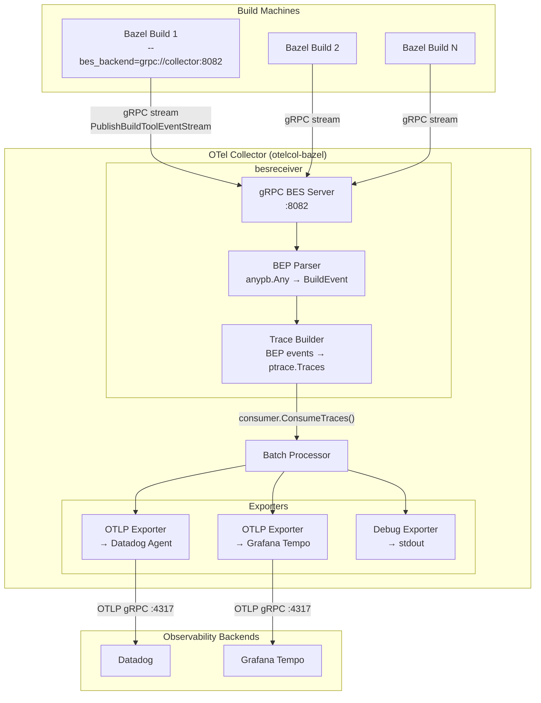
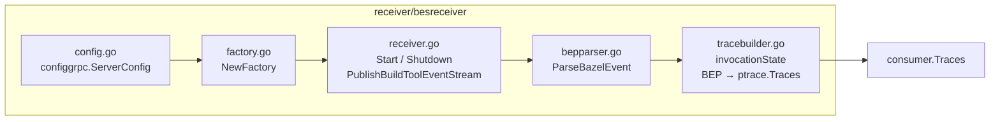
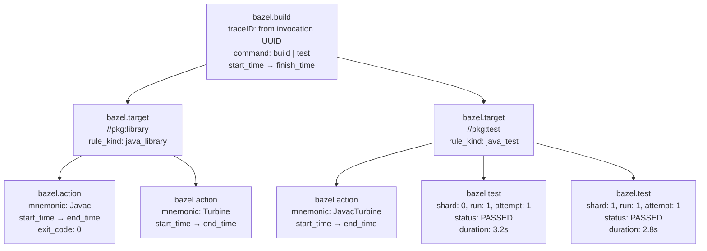
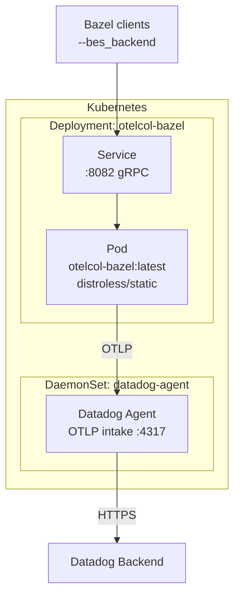

# Architecture

## System Overview

```mermaid
graph TD
    subgraph "Build Machines"
        B1[Bazel Build 1<br/>--bes_backend=grpc://collector:8082]
        B2[Bazel Build 2]
        B3[Bazel Build N]
    end

    subgraph "OTel Collector (otelcol-bazel)"
        subgraph "besreceiver"
            GRPC[gRPC BES Server<br/>:8082]
            PARSER[BEP Parser<br/>anypb.Any → BuildEvent]
            TB[Trace Builder<br/>BEP events → ptrace.Traces]
        end
        BATCH[Batch Processor]
        subgraph "Exporters"
            EXP_DD[OTLP Exporter<br/>→ Datadog Agent]
            EXP_TEMPO[OTLP Exporter<br/>→ Grafana Tempo]
            EXP_DEBUG[Debug Exporter<br/>→ stdout]
        end
    end

    subgraph "Observability Backends"
        DD[Datadog]
        TEMPO[Grafana Tempo]
    end

    B1 -- "gRPC stream<br/>PublishBuildToolEventStream" --> GRPC
    B2 -- "gRPC stream" --> GRPC
    B3 -- "gRPC stream" --> GRPC
    GRPC --> PARSER
    PARSER --> TB
    TB -- "consumer.ConsumeTraces()" --> BATCH
    BATCH --> EXP_DD
    BATCH --> EXP_TEMPO
    BATCH --> EXP_DEBUG
    EXP_DD -- "OTLP gRPC :4317" --> DD
    EXP_TEMPO -- "OTLP gRPC :4317" --> TEMPO
```

## Internal Component Architecture

```mermaid
graph LR
    subgraph "receiver/besreceiver"
        direction TB
        CFG[config.go<br/>configgrpc.ServerConfig]
        FAC[factory.go<br/>NewFactory]
        RCV[receiver.go<br/>Start / Shutdown<br/>PublishBuildToolEventStream]
        BPP[bepparser.go<br/>ParseBazelEvent]
        TRB[tracebuilder.go<br/>invocationState<br/>BEP → ptrace.Traces]
    end

    FAC --> RCV
    CFG --> FAC
    RCV --> BPP
    BPP --> TRB
    TRB --> CON[consumer.Traces]
```

## Trace Span Hierarchy

A single Bazel invocation produces one trace with this span tree:

```mermaid
graph TD
    ROOT["bazel.build<br/>traceID: from invocation UUID<br/>command: build | test<br/>start_time → finish_time"]
    T1["bazel.target<br/>//pkg:library<br/>rule_kind: java_library"]
    T2["bazel.target<br/>//pkg:test<br/>rule_kind: java_test"]
    A1["bazel.action<br/>mnemonic: Javac<br/>start_time → end_time<br/>exit_code: 0"]
    A2["bazel.action<br/>mnemonic: Turbine<br/>start_time → end_time"]
    A3["bazel.action<br/>mnemonic: JavacTurbine<br/>start_time → end_time"]
    TR1["bazel.test<br/>shard: 0, run: 1, attempt: 1<br/>status: PASSED<br/>duration: 3.2s"]
    TR2["bazel.test<br/>shard: 1, run: 1, attempt: 1<br/>status: PASSED<br/>duration: 2.8s"]

    ROOT --> T1
    ROOT --> T2
    T1 --> A1
    T1 --> A2
    T2 --> A3
    T2 --> TR1
    T2 --> TR2
```

## Deployment

```mermaid
graph TD
    subgraph "Kubernetes"
        subgraph "Deployment: otelcol-bazel"
            POD[Pod<br/>otelcol-bazel:latest<br/>distroless/static]
            SVC[Service<br/>:8082 gRPC]
        end
        subgraph "DaemonSet: datadog-agent"
            DDA[Datadog Agent<br/>OTLP intake :4317]
        end
    end

    SVC --> POD
    POD -- "OTLP" --> DDA
    DDA -- "HTTPS" --> DDBE[Datadog Backend]

    BAZEL[Bazel clients<br/>--bes_backend] --> SVC
```
