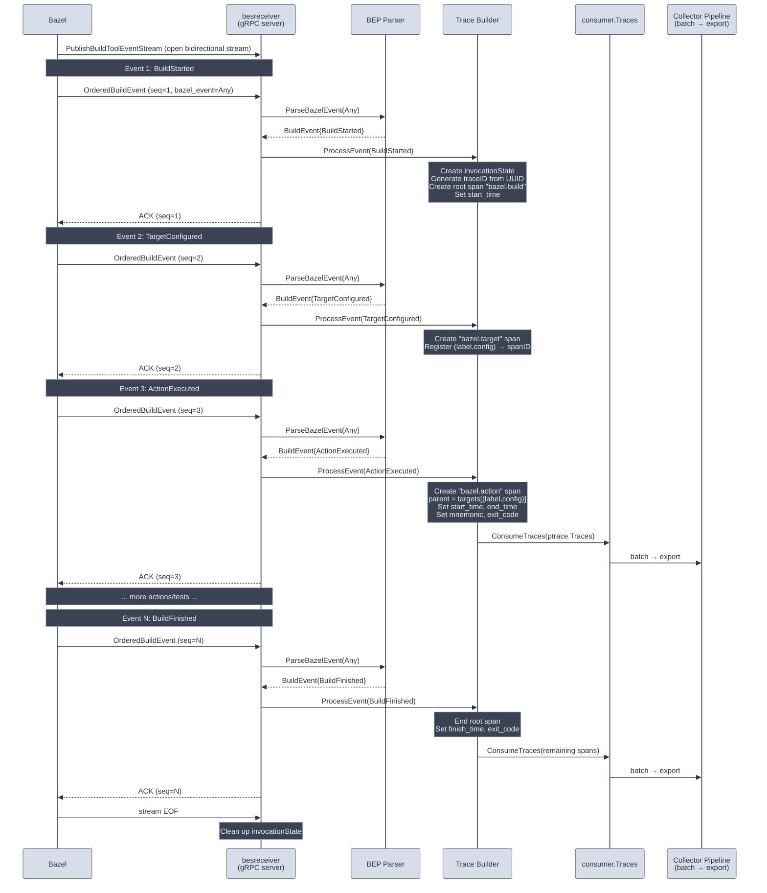
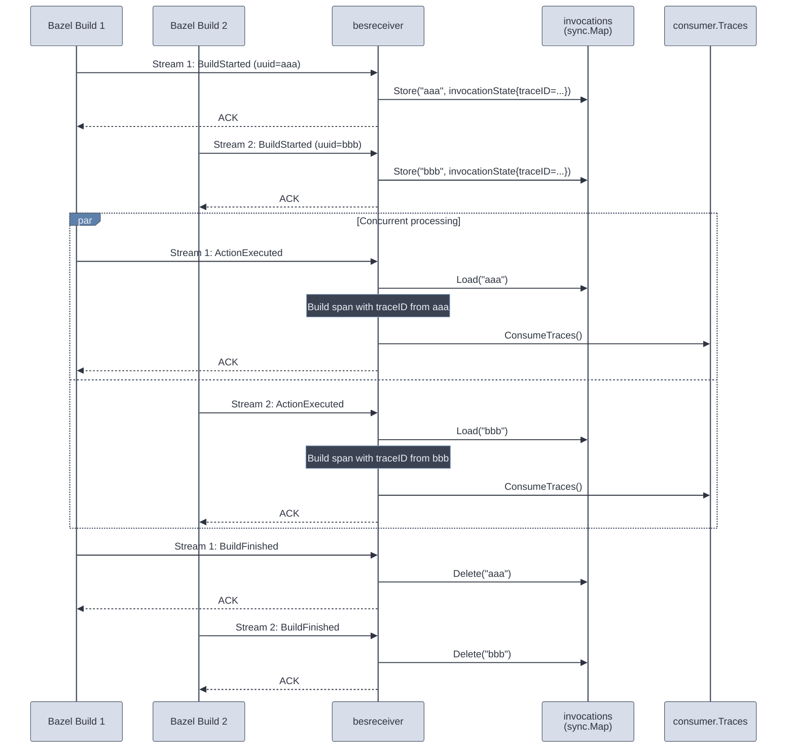
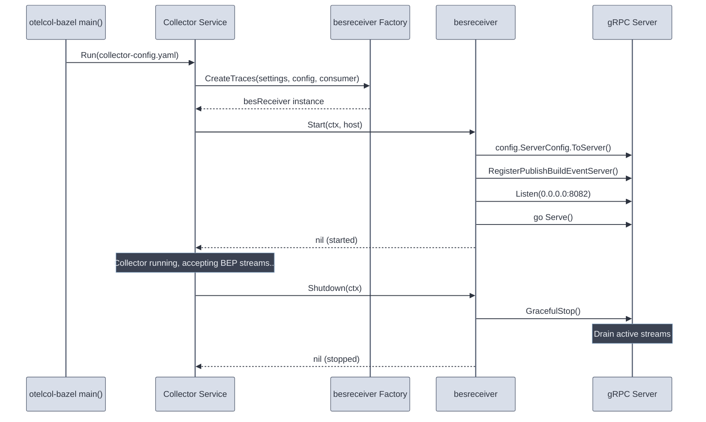

# Sequence Diagrams

## BEP Stream Processing (single invocation)

```mermaid
%%{init: {'theme':'neutral','themeVariables':{'noteBkgColor':'#3b4252','noteTextColor':'#eceff4','noteBorderColor':'#81a1c1','actorBkg':'#d8dee9','actorBorder':'#4c566a','actorTextColor':'#2e3440','actorLineColor':'#4c566a','signalColor':'#2e3440','signalTextColor':'#2e3440','labelBoxBkgColor':'#5e81ac','labelBoxBorderColor':'#4c566a','labelTextColor':'#eceff4','loopTextColor':'#2e3440','sequenceNumberColor':'#eceff4'}}}%%
sequenceDiagram
    participant Bazel
    participant gRPC as besreceiver<br/>(gRPC server)
    participant Parser as BEP Parser
    participant Builder as Trace Builder
    participant Consumer as consumer.Traces
    participant Pipeline as Collector Pipeline<br/>(batch → export)

    Bazel->>gRPC: PublishBuildToolEventStream (open bidirectional stream)

    Note over Bazel,gRPC: Event 1: BuildStarted
    Bazel->>gRPC: OrderedBuildEvent (seq=1, bazel_event=Any)
    gRPC->>Parser: ParseBazelEvent(Any)
    Parser-->>gRPC: BuildEvent{BuildStarted}
    gRPC->>Builder: ProcessEvent(BuildStarted)
    Note over Builder: Create invocationState<br/>Generate traceID from UUID<br/>Create root span "bazel.build"<br/>Set start_time
    gRPC-->>Bazel: ACK (seq=1)

    Note over Bazel,gRPC: Event 2: TargetConfigured
    Bazel->>gRPC: OrderedBuildEvent (seq=2)
    gRPC->>Parser: ParseBazelEvent(Any)
    Parser-->>gRPC: BuildEvent{TargetConfigured}
    gRPC->>Builder: ProcessEvent(TargetConfigured)
    Note over Builder: Create "bazel.target" span<br/>Register (label,config) → spanID
    gRPC-->>Bazel: ACK (seq=2)

    Note over Bazel,gRPC: Event 3: ActionExecuted
    Bazel->>gRPC: OrderedBuildEvent (seq=3)
    gRPC->>Parser: ParseBazelEvent(Any)
    Parser-->>gRPC: BuildEvent{ActionExecuted}
    gRPC->>Builder: ProcessEvent(ActionExecuted)
    Note over Builder: Create "bazel.action" span<br/>parent = targets[(label,config)]<br/>Set start_time, end_time<br/>Set mnemonic, exit_code
    Builder->>Consumer: ConsumeTraces(ptrace.Traces)
    Consumer->>Pipeline: batch → export

    gRPC-->>Bazel: ACK (seq=3)

    Note over Bazel,gRPC: ... more actions/tests ...

    Note over Bazel,gRPC: Event N: BuildFinished
    Bazel->>gRPC: OrderedBuildEvent (seq=N)
    gRPC->>Parser: ParseBazelEvent(Any)
    Parser-->>gRPC: BuildEvent{BuildFinished}
    gRPC->>Builder: ProcessEvent(BuildFinished)
    Note over Builder: End root span<br/>Set finish_time, exit_code
    Builder->>Consumer: ConsumeTraces(remaining spans)
    Consumer->>Pipeline: batch → export
    gRPC-->>Bazel: ACK (seq=N)

    Bazel->>gRPC: stream EOF
    Note over gRPC: Clean up invocationState
```

## Concurrent Invocations

```mermaid
%%{init: {'theme':'neutral','themeVariables':{'noteBkgColor':'#3b4252','noteTextColor':'#eceff4','noteBorderColor':'#81a1c1','actorBkg':'#d8dee9','actorBorder':'#4c566a','actorTextColor':'#2e3440','actorLineColor':'#4c566a','signalColor':'#2e3440','signalTextColor':'#2e3440','labelBoxBkgColor':'#5e81ac','labelBoxBorderColor':'#4c566a','labelTextColor':'#eceff4','loopTextColor':'#2e3440','sequenceNumberColor':'#eceff4'}}}%%
sequenceDiagram
    participant B1 as Bazel Build 1
    participant B2 as Bazel Build 2
    participant Recv as besreceiver
    participant State as invocations<br/>(sync.Map)
    participant Consumer as consumer.Traces

    B1->>Recv: Stream 1: BuildStarted (uuid=aaa)
    Recv->>State: Store("aaa", invocationState{traceID=...})
    Recv-->>B1: ACK

    B2->>Recv: Stream 2: BuildStarted (uuid=bbb)
    Recv->>State: Store("bbb", invocationState{traceID=...})
    Recv-->>B2: ACK

    par Concurrent processing
        B1->>Recv: Stream 1: ActionExecuted
        Recv->>State: Load("aaa")
        Note over Recv: Build span with traceID from aaa
        Recv->>Consumer: ConsumeTraces()
        Recv-->>B1: ACK
    and
        B2->>Recv: Stream 2: ActionExecuted
        Recv->>State: Load("bbb")
        Note over Recv: Build span with traceID from bbb
        Recv->>Consumer: ConsumeTraces()
        Recv-->>B2: ACK
    end

    B1->>Recv: Stream 1: BuildFinished
    Recv->>State: Delete("aaa")
    Recv-->>B1: ACK

    B2->>Recv: Stream 2: BuildFinished
    Recv->>State: Delete("bbb")
    Recv-->>B2: ACK
```

## Collector Startup Lifecycle

```mermaid
%%{init: {'theme':'neutral','themeVariables':{'noteBkgColor':'#3b4252','noteTextColor':'#eceff4','noteBorderColor':'#81a1c1','actorBkg':'#d8dee9','actorBorder':'#4c566a','actorTextColor':'#2e3440','actorLineColor':'#4c566a','signalColor':'#2e3440','signalTextColor':'#2e3440','labelBoxBkgColor':'#5e81ac','labelBoxBorderColor':'#4c566a','labelTextColor':'#eceff4','loopTextColor':'#2e3440','sequenceNumberColor':'#eceff4'}}}%%
sequenceDiagram
    participant Main as otelcol-bazel main()
    participant Svc as Collector Service
    participant Fac as besreceiver Factory
    participant Recv as besreceiver
    participant gRPC as gRPC Server

    Main->>Svc: Run(collector-config.yaml)
    Svc->>Fac: CreateTraces(settings, config, consumer)
    Fac-->>Svc: besReceiver instance
    Svc->>Recv: Start(ctx, host)
    Recv->>gRPC: config.ServerConfig.ToServer()
    Recv->>gRPC: RegisterPublishBuildEventServer()
    Recv->>gRPC: Listen(0.0.0.0:8082)
    Recv->>gRPC: go Serve()
    Recv-->>Svc: nil (started)

    Note over Svc: Collector running, accepting BEP streams...

    Svc->>Recv: Shutdown(ctx)
    Recv->>gRPC: GracefulStop()
    Note over gRPC: Drain active streams
    Recv-->>Svc: nil (stopped)
```
